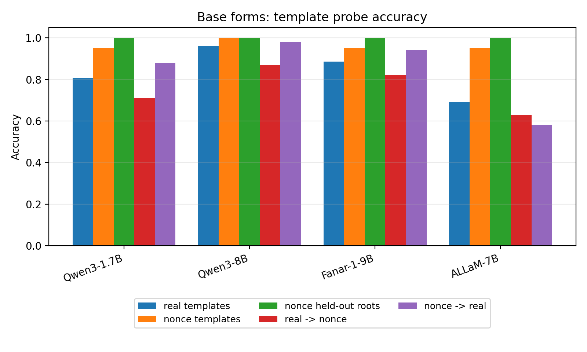
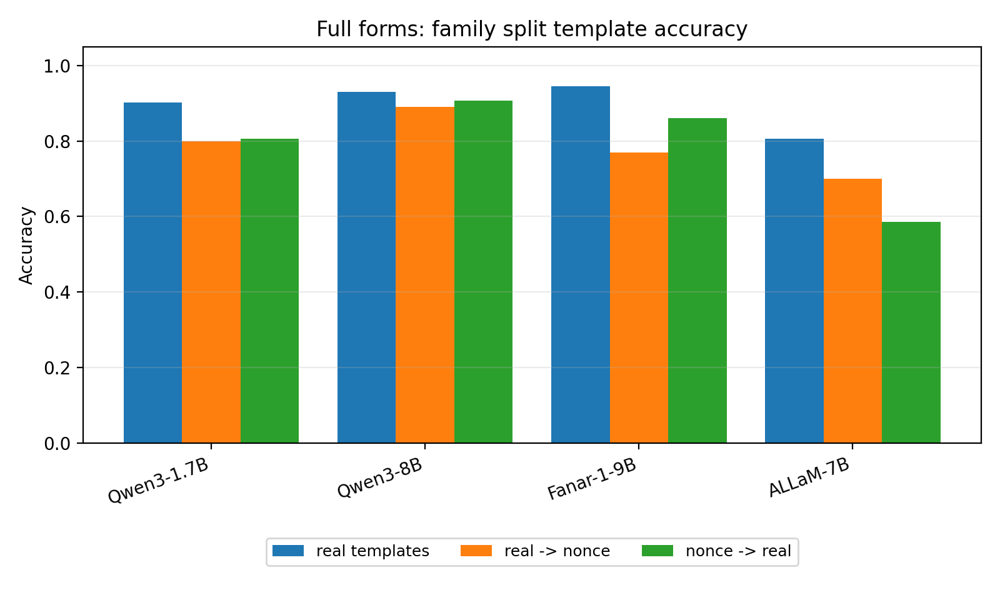
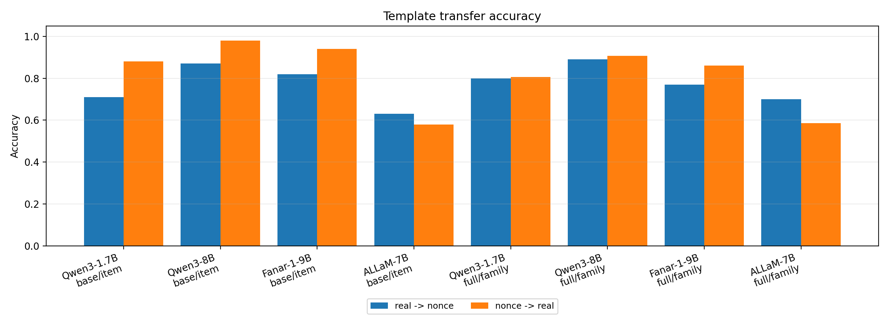
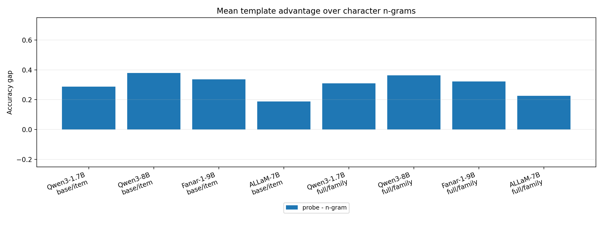
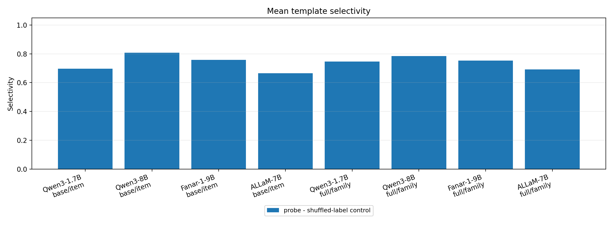
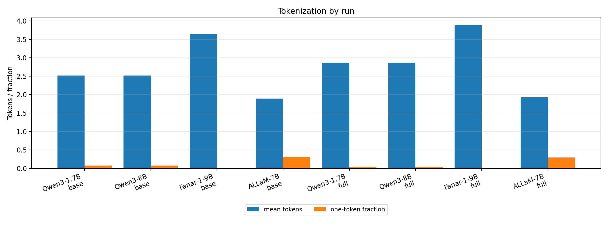
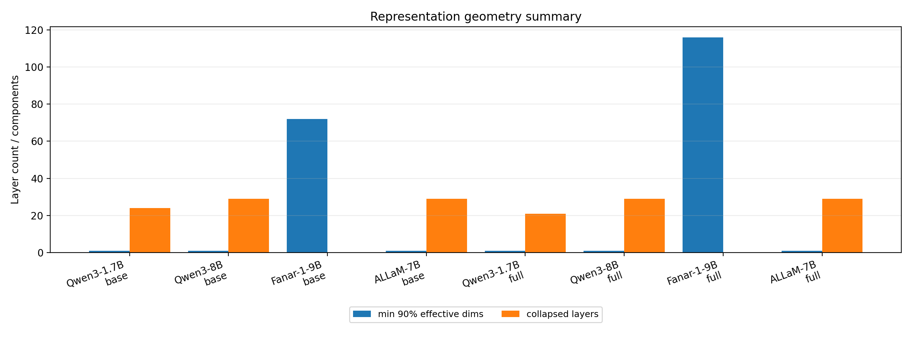
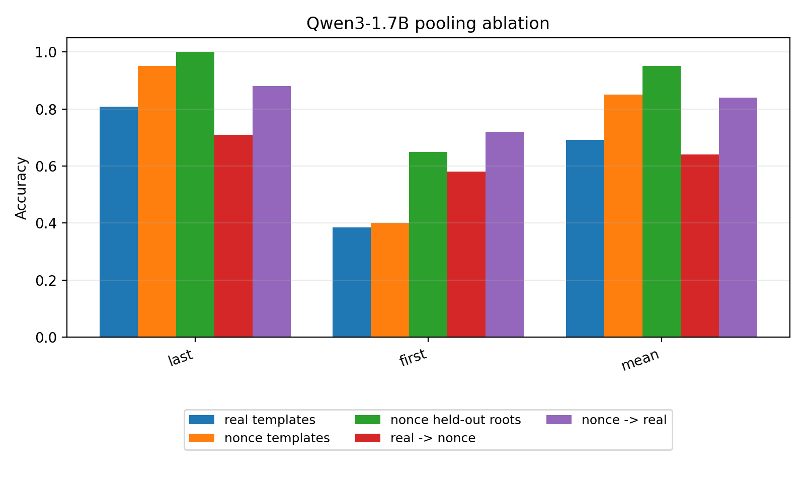

# Brief: Probing Arabic Root-Pattern Morphology Inside LLMs

Date: 2026-05-03  
Status: internal research brief for discussion

## One-Sentence Summary

We ran linear probes on hidden word representations from decoder-only LLMs and found that Arabic derivational template information is recoverable across models, but transfer strength, affix robustness, tokenization behavior, and representation geometry vary substantially by model.

## Why We Are Doing This

Recent work by Alakeel et al., *Morphemes Without Borders: Evaluating Root-Pattern Morphology in Arabic Tokenizers and LLMs*, evaluates Arabic root-pattern morphology using tokenizer alignment and prompt-based generation tasks.

Paper: https://arxiv.org/pdf/2603.15773

That setup is important, but prompt-based generation can conflate multiple abilities:

- knowing Arabic morphology
- following task instructions
- formatting the answer correctly
- benefiting from in-context examples
- producing a short output that is easy to score

Our study asks a complementary question:

```text
Is Arabic derivational template information already present in the model's internal word representations?
```

This avoids generation and output parsing. The model is not asked to produce a word. We feed isolated Arabic forms into the model, extract hidden states, and test whether a simple classifier can recover morphological labels.

Important caution: this shows linear recoverability of information. It does not by itself prove that the model causally uses this feature during generation.

## Data

We use the productivity dataset from the Alakeel et al. repository/workflow:

- real Arabic root-template forms
- nonce root-template forms
- base forms
- affixed full forms for real examples
- labels for root and template

The real subset includes root-template forms and affixed variants. The nonce subset currently contains base forms only.

## Models Tested

| Model | Reason Included |
|---|---|
| `Qwen/Qwen3-1.7B-Base` | small pilot model, fast iteration |
| `Qwen/Qwen3-8B` | larger Qwen model, scale comparison |
| `QCRI/Fanar-1-9B` | Arabic-centric model with morphology-aware tokenizer design |
| `humain-ai/ALLaM-7B-Instruct-preview` | Arabic-centric model, important comparison point |

## Core Method

For each input word, we extract hidden states from every transformer layer. For decoder-only models, our main representation is the **last subword token** of the word.

Why last subword?

- Most Arabic words are split into multiple subwords.
- In a causal decoder, the last subword can attend to earlier subword pieces.
- Prior work commonly treats the last subword as the word-level representation in decoder-only models.
- Our own pooling ablations support this: first-subword pooling is much weaker, while mean pooling recovers much of the signal.

We train simple linear probes to predict:

- derivational template
- root identity

The paper-level focus is template probing, not root probing.

## Controls And Splits

We use several controls to avoid overclaiming.

| Control / Split | Purpose |
|---|---|
| Shuffled-label control | Tests whether the probe can fit arbitrary labels in the same setting. |
| Character n-gram baseline | Tests whether surface character cues alone solve the task. |
| Nonce held-out-root split | Tests template recovery on nonce roots not seen during probe training. |
| Real -> nonce transfer | Train on real forms, test on nonce forms. |
| Nonce -> real transfer | Train on nonce forms, test on real forms. |
| Full-form family split | For affixed real forms, keeps all variants of the same `(root, template, base_form)` family on one side of the split to avoid sibling leakage. |
| Pooling ablation | Compares last, first, and mean pooling on Qwen3-1.7B. |

Important caveat: nonce held-out-root probing is clean with respect to root overlap, but it may still be easy because template shapes leave strong surface cues. Therefore, we treat the 1.000 nonce result as evidence for template-shape recoverability, not as standalone proof of abstract morphology.

## Main Results

### Base-Form Template Probing

| Run | Model | Real Templates | Nonce Templates | Nonce Held-Out Roots | Real -> Nonce | Nonce -> Real |
|---|---|---:|---:|---:|---:|---:|
| E03 | Qwen3-1.7B | 0.808 | 0.950 | 1.000 | 0.710 | 0.880 |
| E06 | Qwen3-8B | 0.962 | 1.000 | 1.000 | 0.870 | 0.980 |
| E07 | Fanar-1-9B | 0.885 | 0.950 | 1.000 | 0.820 | 0.940 |
| E08 | ALLaM-7B | 0.692 | 0.950 | 1.000 | 0.630 | 0.580 |

Takeaway:

All models reach 1.000 on nonce held-out-root template probing. This is strong cross-model evidence that template information is recoverable in the controlled nonce setting. The harder differentiator is transfer, where Qwen3-8B is strongest and ALLaM is weakest.

Plot:



### Full-Form Family-Split Probing

Here, real examples include affixed forms. The family split prevents affixed siblings of the same base form from leaking across train and test.

| Run | Model | Real Templates Family | N-Gram | Real -> Nonce | Nonce -> Real |
|---|---|---:|---:|---:|---:|
| E05b | Qwen3-1.7B | 0.903 | 0.667 | 0.800 | 0.807 |
| E06b | Qwen3-8B | 0.931 | 0.667 | 0.890 | 0.907 |
| E07b | Fanar-1-9B | 0.944 | 0.667 | 0.770 | 0.860 |
| E08b | ALLaM-7B | 0.806 | 0.667 | 0.700 | 0.587 |

Takeaway:

The full-form family split is one of the strongest parts of the study. It closes the obvious affix-sibling leakage issue from the earlier full-form run while preserving high template accuracy for Qwen and Fanar.

Plot:



### Transfer Comparison

The transfer probes are important because they test whether template information moves across real and nonce subsets.



High-level ranking on transfer:

```text
Qwen3-8B > Fanar-1-9B > Qwen3-1.7B > ALLaM-7B
```

ALLaM is the main counterexample. It performs well on nonce template probes, but weakly on real/nonce transfer, especially nonce -> real.

### N-Gram Gap And Selectivity

The probe should not only beat chance. It should beat simple surface baselines and shuffled-label controls.





Takeaway:

The positive result is not just "the classifier learned something." The more meaningful evidence is the gap over character n-grams and shuffled-label controls, especially in the main template probes.

## Tokenization Result

The models tokenize Arabic very differently.

| Model | Base Mean Tokens | Full Mean Tokens | Interpretation |
|---|---:|---:|---|
| Qwen3 | 2.52 | 2.87 | moderate fragmentation |
| Fanar | 3.64 | 3.89 | heavy fragmentation |
| ALLaM | 1.90 | 1.92 | compact tokenization |

Plot:



Takeaway:

Performance does not reduce to token count. Fanar is heavily fragmented but strong. ALLaM is compactly tokenized but weaker on real/nonce transfer. This aligns with Alakeel et al.'s broader conclusion that tokenizer morphology or compactness is not sufficient to predict downstream morphological behavior.

## Representation Geometry

We also computed basic representation diagnostics.

| Run | Model | Surface | Min edim90 | Collapsed Layers | Max Abs Activation |
|---|---|---|---:|---:|---:|
| E03 | Qwen3-1.7B | base | 1 | 24 | 12736.0 |
| E06 | Qwen3-8B | base | 1 | 29 | 13920.0 |
| E07 | Fanar-1-9B | base | 72 | 0 | 509.0 |
| E08 | ALLaM-7B | base | 1 | 29 | 1694.0 |
| E05b | Qwen3-1.7B | full | 1 | 21 | 12736.0 |
| E06b | Qwen3-8B | full | 1 | 29 | 13904.0 |
| E07b | Fanar-1-9B | full | 116 | 0 | 539.0 |
| E08b | ALLaM-7B | full | 1 | 29 | 1694.0 |

Plot:



Takeaway:

Qwen and ALLaM show severe mid-layer activation outliers and effective-dimensionality collapse. Fanar has much cleaner geometry. This makes exact layer localization risky for Qwen and ALLaM. Fanar may be more interpretable for layer-wise claims.

## Pooling Ablation

We ran pooling controls on Qwen3-1.7B.



Takeaway:

First-subword pooling is much weaker. Last-subword and mean pooling perform much better. This supports the interpretation that the probe needs access to the whole subword sequence, not just the first visible fragment of the word.

## Root Probes

Root probes are useful diagnostics, but they should not be the paper's main claim.

Reason:

```text
nonce root probe: 1.000
n-gram baseline: 0.950
```

The root consonants are often visibly present in the surface form. Therefore, nonce root identity is nearly solvable from character n-grams alone.

The main paper claim should be about derivational template recoverability.

## Current Interpretation

The study is worth completing. The most defensible current claim is:

```text
Decoder-only LLMs expose Arabic derivational template information in word-level representations.
This signal generalizes robustly in controlled nonce held-out-root settings.
Real/nonce transfer and affixed-form robustness vary substantially across models.
```

Model-specific interpretation:

- Qwen3-8B is strongest on real/nonce transfer.
- Fanar is strongest on affixed real full-form family split and has the cleanest representation geometry.
- ALLaM is strong on nonce template probes but weak on real/nonce transfer.
- Arabic-centric models are not uniformly better.
- Tokenization compactness does not predict representational morphology performance.

## How This Relates To Alakeel et al.

Alakeel et al. report irregular model behavior across Arabic-centric and multilingual LLMs, and they argue that tokenizer morphological alignment is not necessary or sufficient for morphological generation.

Our results are aligned with that broad pattern:

- Fanar has heavy fragmentation but strong probing results.
- ALLaM has compact tokenization but weak transfer.
- Qwen3-8B is not Arabic-centric but is strongest on transfer.

The difference is that Alakeel et al. mainly test output behavior, while we test internal representations. This is the main contribution angle:

```text
They ask whether models can generate morphologically correct forms.
We ask whether the relevant morphological information is present inside model representations.
```

## What We Should Not Claim Yet

We should not claim:

- that the model causally uses template features during generation
- that root identity is abstractly represented beyond surface spelling
- that all Arabic-centric models are better
- that the nonce 1.000 result alone proves productive morphology
- that exact layer localization is settled across all models

## Recommended Next Steps

1. Write the paper around template probing, not root probing.
2. Use full-form family split and real/nonce transfer as the strongest evidence.
3. Add nonce affixed forms only if we want one more robustness experiment.
4. Treat layer-wise findings cautiously because of geometry collapse in Qwen and ALLaM.
5. Ask colleagues whether the current control set is enough, or whether nonce affix augmentation is necessary before drafting.

## Discussion Questions For Colleagues

1. Is linear recoverability from hidden states a strong enough complement to prompt-based generation?
2. Is the nonce held-out-root result convincing, or too surface-shape driven?
3. Should we add nonce affixed forms before writing?
4. Should Fanar's clean geometry become a separate result, or remain a diagnostic caveat?
5. What is the safest paper claim: "template information is represented" or "template information is recoverable"?

## Artifacts

Generated summary:

- [Cross-model summary](results/summary/cross_model_summary.md)

Detailed interpretations:

- [Cross-model interpretation](results/cross_model_interpretation.md)
- [Results log](results/README.md)
- [Experiment tracker](experiments.md)

Generated tables:

- [Probe metrics CSV](results/summary/probe_metrics.csv)
- [Tokenization summary CSV](results/summary/tokenization_summary.csv)
- [Geometry summary CSV](results/summary/geometry_summary.csv)
- [Token-count accuracy CSV](results/summary/token_count_accuracy.csv)
